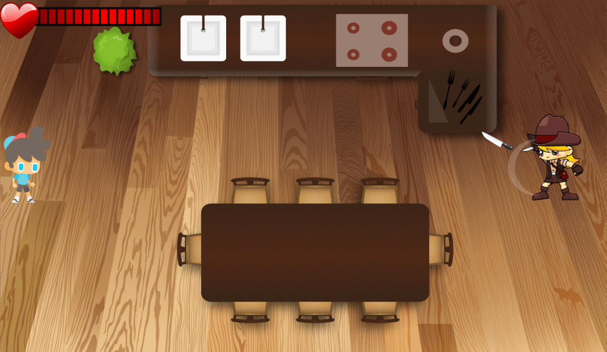
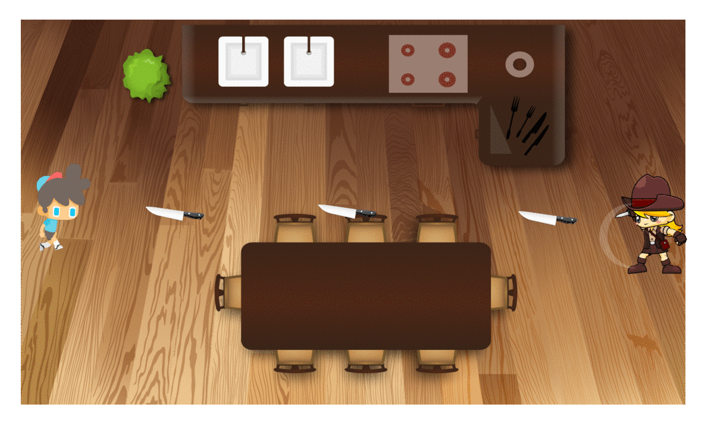
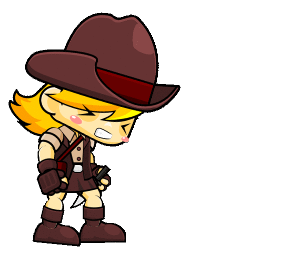
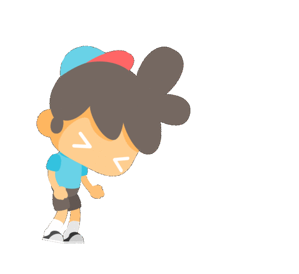

# AngryMama
 This is Game been Developed for Lambton college Game Development Final Project
 
# GAME IMPLEMENTATION
Final Project Repository of the Game Angry Mama for MAD5244 Game Design and Development for iOS and Android

# Members
- Das Tarlochan (C0751142) 
- Nikhil Nikhil (C0753159) 
- Kishore Narang (C0752984) 

# Features
- Made using Sprite Kit in XCode.
- Made All Game Assets in Adobe Illustrator.
- Three levels.
- Hero automatically moves up and down, forever.
- When player collects 10 love in level 1 than switch to level 2.
- When player collects 15 love in level 2 than switch to level 3.
- When player collects 20 love in level 3 than switch to Win Screen.
- When player collects loses all lives than switch to Lose Screen.
- Level 1 have same weapons thrown by enemy.
- Level 2 have different weapons thrown by enemy.
- Level 3 have different weapons and different damage thrown by enemy.
- Detects when game is over & YOU LOSE screen is shown.
- Detect when the player wins & YOU WIN screen is shown.
- Plays Background sound, weapon hit sounds, love hit sound, win or lose game sound.

# Animations:
 
 
 
 
 
 
 
 
 
 
 

 

 
 
